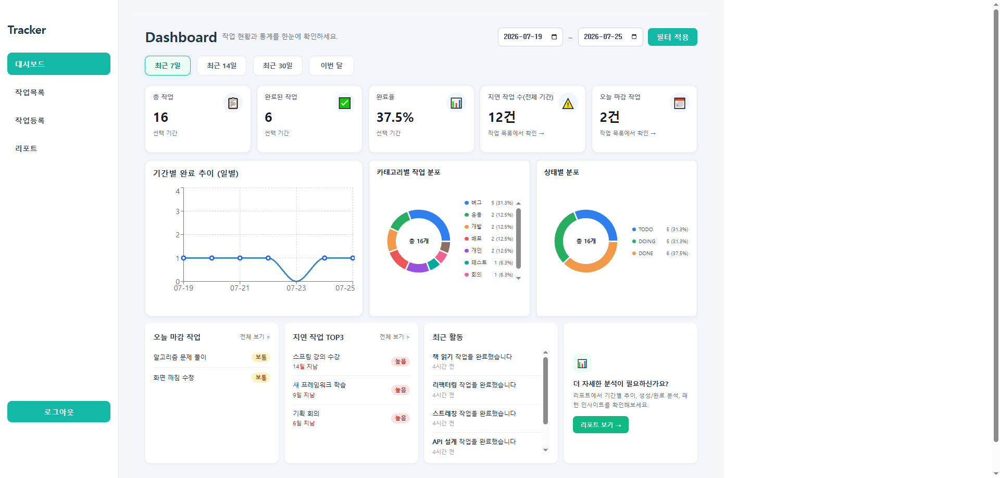
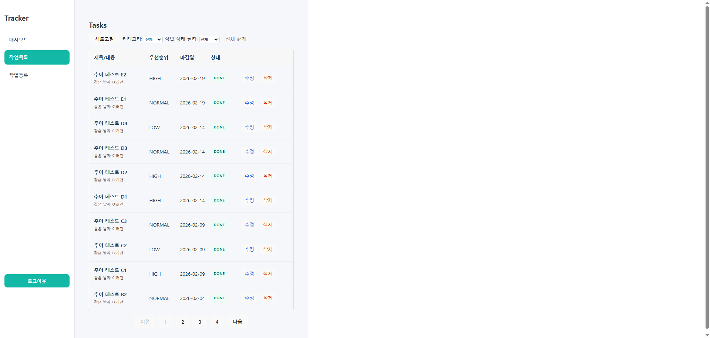
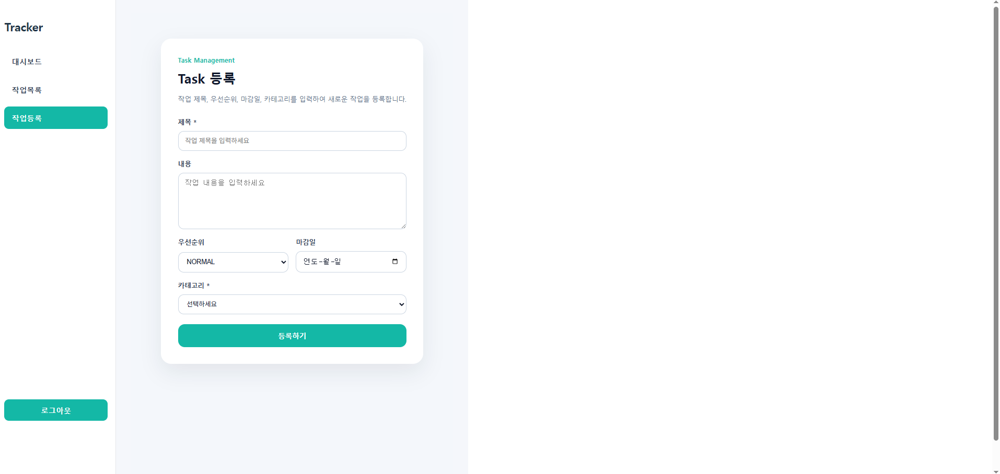
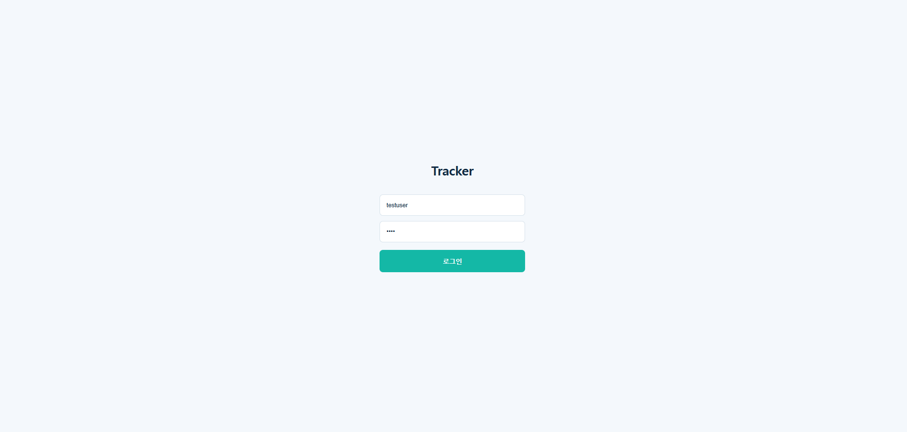
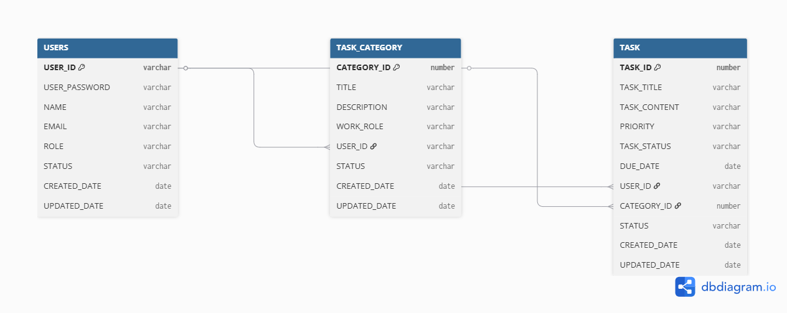

# Task Tracker

## 프로젝트 소개
작업(Task)을 관리하면서 진행 상태를 한눈에 파악할 수 있도록 만든 트래커 프로젝트입니다.

단순히 할 일을 저장하는 기능을 넘어서,  
마감일 기준으로 작업 현황을 분석할 수 있는 대시보드를 함께 구성했습니다.

작업을 “관리하는 것”과 “분석하는 것”을 분리해서  
보다 명확한 구조로 설계한 것이 핵심입니다.

---

## 프로젝트 정보

- 개인 프로젝트
- 개발 기간 : 2026.01 ~ 2026.06
- Backend / Frontend 설계 및 구현
- 개발 목적 : 작업 관리 데이터를 기반으로 한 관리형 Dashboard 시스템 구현

---

## 실행 화면

### 대시보드


### 리포트


### 작업 목록


### 작업 등록


### 로그인


---

## 주요 특징

- 작업 관리와 통계 영역 분리
- DUE_DATE 기준 대시보드 분석
- Today / Overdue 작업 분리 관리
- 지연 작업 TOP3 / 최근 활동 내역 제공
- 대시보드에서 리포트 페이지로의 연결 동선 구성
- Controller / Service / DAO 계층 분리
- React Custom Hook 기반 구조 분리
- Dashboard 리팩터링 적용

---

## 사용 기술

### Backend
- Java 17
- Spring Boot
- MyBatis
- Oracle DB
- HttpSession 기반 인증

### Frontend
- React
- Vite
- React Router
- Recharts

---

## ERD



### 테이블 설계

- USERS
  - 사용자 계정 정보 관리
  - 로그인 및 사용자별 데이터 분리를 위한 기준 테이블

- TASK_CATEGORY
  - 사용자가 생성한 작업 카테고리 관리
  - 사용자별 카테고리 분리

- TASK
  - 실제 작업 정보 저장
  - 작업 상태(TODO / DOING / DONE)
  - 우선순위 및 마감일 관리

- TASK_LOG
  - 작업 생성/상태 변경/삭제 이력 저장
  - 대시보드 "최근 활동" 및 작업별 이력 조회에 사용

---

## API 명세

### Category API

| Method | URL | 설명 |
|---|---|---|
|GET|`/api/categories`|카테고리 목록 조회|

---

### Task API

| Method | URL | 설명 |
|---|---|---|
|GET|`/api/tasks`|작업 목록 조회|
|POST|`/api/tasks`|작업 등록|
|PUT|`/api/tasks/{taskId}`|작업 수정|
|DELETE|`/api/tasks/{taskId}`|작업 삭제|
|PATCH|`/api/tasks/{taskId}/status`|작업 상태 변경|
|GET|`/api/tasks/today`|오늘 마감 작업 목록 조회|
|GET|`/api/tasks/overdue`|마감일 지난 미완료 작업 조회|

---

### Task Log API

| Method | URL | 설명 |
|---|---|---|
|GET|`/api/tasks/{taskId}/logs`|특정 작업의 상태 변경 이력 조회|
|GET|`/api/tasks/recent-activities`|사용자 기준 최근 활동 내역 조회 (limit 개수 제한, 기본 5건)|

---

### Dashboard API

| Method | URL | 설명 |
|---|---|---|
|GET|`/api/dashboard`|대시보드 통계 조회|
|GET|`/api/dashboard/trend`|기간별 완료 추이 조회|

### Dashboard Parameter

|Parameter|설명|
|-|-|
|startDate|조회 시작일|
|endDate|조회 종료일|
|categoryId|카테고리 필터|
|groupBy|일/주/월 그룹 기준|

---

### Report API

| Method | URL | 설명 |
|---|---|---|
|GET|`/api/reports/summary`|기간 요약 통계 조회|
|GET|`/api/reports/completion-trend`|기간별 완료 추이 조회|
|GET|`/api/reports/category-performance`|카테고리별 성과 조회|
|GET|`/api/reports/priority-performance`|우선순위별 성과 조회|
|GET|`/api/reports/tasks`|기간 내 작업 상세 목록 조회|
|GET|`/api/reports/time-analysis`|완료 시간 및 마감 준수 현황 분석|

---

## 인증 구조

JWT 방식이 아닌 서버 세션 기반 인증 방식을 적용했습니다.

로그인 성공 시 서버의 HttpSession에 사용자 정보를 저장하고,
이후 요청에서는 저장된 세션 정보를 기준으로 사용자 데이터를 조회합니다.

### 인증 흐름

```text
React Login 요청

↓

Spring Controller

↓

Service 사용자 검증

↓

HttpSession 저장

↓

USER_ID 기준 데이터 조회
```

프론트엔드는 세션 쿠키 전달을 위해 다음 옵션을 사용했습니다.

```javascript
fetch("/api/tasks", {
    credentials:"include"
})
```

이를 통해 로그인 사용자별 독립적인 작업 데이터와
대시보드 통계를 제공합니다.

---

## 실행 방법

### 환경 설정

`src/main/resources/application-example.yaml` 파일을 참고하여  
`application.yaml` 파일을 생성 후 개인 DB 정보를 입력합니다.

```yaml
spring:
  datasource:
    username: YOUR_DB_USERNAME
    password: YOUR_DB_PASSWORD
```

---

### Backend 실행
```bash
./gradlew bootRun
```

### Frontend 실행
```bash
cd frontend
npm install
npm run dev
```

### 접속
- http://localhost:5173 에서 확인 가능

---

## 현재 구현된 기능

### 작업 관리
- 작업 생성 / 수정 / 삭제
- 상태 관리 (TODO / DOING / DONE)
- 우선순위 설정
- 카테고리 분류
- 작업별 상태 변경 이력 조회

### 사용자
- 세션 기반 로그인 처리
- 사용자별 작업 데이터 분리

### 대시보드
- 전체 작업 수 / 완료 작업 수 / 완료율
- 우선순위별 분포
- 카테고리별 분포
- 오늘 마감 작업 조회
- 지연 작업 조회
- 지연 작업 TOP3 (우선순위 → 지연일수 기준 정렬)
- 최근 활동 내역 (작업 로그 기반, 상대 시간 표시)
- 리포트 페이지 연결 배너

### 리포트
- 기간 요약 통계
- 일별/주별/월별 완료 추이
- 카테고리별 / 우선순위별 성과
- 완료 시간 및 마감 준수율 분석
- 작업 패턴 인사이트

---

## 설계 방향

### 1. 관리와 통계 영역 분리
- 대시보드 → 작업 현황을 숫자로 확인
- 작업 목록 → 실제 작업 관리

두 영역을 분리해서  
데이터 확인과 작업 수행이 섞이지 않도록 설계했습니다.

---

### 2. 마감일(DUE_DATE) 기준 통계
생성일이 아닌 마감일 기준으로 통계를 구성하여  
실제 작업 흐름에 맞는 분석이 가능하도록 설계했습니다.

---

### 3. Today / Overdue 기능 분리
오늘 마감 작업과 지연 작업은 단순 필터가 아니라  
사용자가 즉시 확인해야 하는 정보라고 판단하여  
별도의 기능으로 분리했습니다.

---

### 4. 대시보드 → 작업목록 연결 구조
대시보드에서는 상세 데이터를 직접 보여주기보다  
건수 중심으로 요약하고, 클릭 시 해당 작업 목록으로 이동하도록 설계했습니다.

---

### 5. 대시보드 → 리포트 연결 구조
대시보드는 "지금 상황을 빠르게 훑어보는" 용도로,
리포트는 "기간을 두고 깊게 분석하는" 용도로 역할을 나누었습니다.

대시보드 하단에 리포트 페이지로 연결되는 배너를 두어
두 화면의 목적을 명확히 구분하면서도 자연스럽게 이어지도록 구성했습니다.

---

## 프로젝트 구조
```
backend
├─ controller
├─ service
├─ dao
├─ mapper (MyBatis XML)
└─ vo / dto

frontend
├─ pages
├─ components
├─ hooks
├─ utils
└─ api
```

- Controller는 요청과 응답 처리에만 집중하고,
- Service에서는 실제 비즈니스 로직을 담당하도록 분리했습니다.
- DAO는 데이터베이스 접근만 담당하게 해서 책임을 명확하게 나눴습니다.
- 이와 같이 계층을 분리하여 역할을 명확히 하고,
  유지보수와 확장성을 고려한 구조로 설계했습니다.

---

## 대시보드 리팩터링

초기에는 DashboardPage 내부에서
상태 관리, API 조회, UI 출력 로직을 모두 처리했습니다.

하지만 기능이 증가하면서 컴포넌트 크기가 커지고,
조회 로직과 화면 로직이 섞이기 시작해
유지보수성이 떨어지는 문제가 발생했습니다.

이를 개선하기 위해 역할 기준으로 구조를 분리했습니다.

### 분리 내용
- SummaryCard / DonutChartBox / AnalysisBox 컴포넌트 분리
- TodayTaskListCard / OverdueTopThreeCard / RecentActivityCard / ReportBannerCard 컴포넌트 분리
- DashboardFilter 컴포넌트 분리
- useDashboardData 커스텀 Hook 분리
- 날짜 계산 로직(dateUtils) 분리
- 분석 문장 생성 로직(dashboardAnalysis) 분리
- 인라인 스타일을 컴포넌트별 CSS 파일로 분리

이를 통해
- 페이지 역할 단순화
- 재사용성 향상
- 유지보수성 개선
- UI와 로직 책임 분리

를 목표로 구조를 개선했습니다.

---

## 트러블슈팅

### 1. ORA-00918 ambiguous column 오류

카테고리별 통계 조회 과정에서
JOIN 사용 시 컬럼명이 중복되면서 ORA-00918 오류가 발생했습니다.

원인을 분석한 결과,
TASK와 CATEGORY 테이블 양쪽에 동일한 컬럼명이 존재했고,
컬럼 alias를 명확하게 지정하지 않은 것이 문제였습니다.

이후 모든 JOIN 구문에서 alias를 명확히 분리하여 해결했습니다.

---

### 2. 기간별 완료 추이 그래프 데이터 문제

초기에는 CREATED_DATE 기준으로 완료 추이를 구성했습니다.

하지만 실제 작업 흐름은
“언제 생성했는가”보다
“언제까지 완료해야 하는가(DUE_DATE)”가 더 중요하다고 판단했습니다.

그래서 통계 기준을 DUE_DATE 중심으로 변경했고,
이를 통해 실제 마감 흐름에 가까운 통계가 가능하도록 수정했습니다.

---

### 3. DashboardPage 복잡도 증가 문제

초기 DashboardPage 내부에는
상태 관리, API 호출, 분석 문장 생성, UI 출력 로직이 모두 포함되어 있었습니다.

기능이 증가할수록 코드 길이가 길어지고
수정 시 영향 범위를 파악하기 어려워지는 문제가 발생했습니다.

이를 해결하기 위해:
- 컴포넌트 분리
- utils 분리
- custom hook 분리

를 적용하여 역할별 구조로 리팩토링했습니다.

이를 통해 DashboardPage는
“화면 조립과 필터 상태 관리” 중심으로 단순화되었습니다.

---

### 4. 시간 분석 지표(마감 준수율 등)가 0으로만 나오는 문제

시연용 데모 데이터를 생성할 때 TASK 테이블에는 완료 상태(DONE)만 직접 입력하고
TASK_LOG에는 완료 이력을 남기지 않아, 조인 결과 completedDate가 항상 NULL로 조회되는 문제가 있었습니다.

이로 인해 마감 준수율, 평균 완료/지연 소요일이 모두 0으로 계산되는 현상이 발생했습니다.

원인 확인 후, 데모 데이터 생성 시 DONE 상태로 등록되는 작업에 대해
TASK_LOG에도 완료 이력을 함께 생성하도록 수정하여 해결했습니다.

---

### 5. 대시보드 하단 카드 높이 불일치 문제

오늘 마감 작업 / 지연 작업 TOP3 / 최근 활동 / 리포트 배너 카드를 한 줄에 배치할 때,
카드마다 내용물 양이 달라 높이가 서로 맞지 않는 문제가 있었습니다.

Flexbox의 stretch 정렬만으로는 완전히 해결되지 않아,
각 카드의 높이를 고정값(300px)으로 지정하고
내부 리스트만 스크롤 처리하는 방식으로 해결했습니다.

---

### 6. Dashboard/Reports 페이지 레이아웃 폭 불일치 문제

두 페이지가 같은 레이아웃(사이드바 + 본문)을 공유하는데도
본문 컨테이너의 실제 렌더링 폭이 서로 달라, 화면 전환 시 이질감이 있는 문제가 있었습니다.

원인은 컨테이너에 `max-width`만 지정하고 `width`를 지정하지 않아,
flex 컨테이너 내부에서 콘텐츠 양에 따라 컨테이너 자체의 폭이 다르게 계산되었기 때문이었습니다.

두 페이지의 컨테이너 스타일을 완전히 동일한 규칙으로 통일하여 해결했습니다.

---

## 개선 예정

- 작업 분석 코멘트 기능 고도화
  - 완료율 변화 / 지연 비율 자동 분석

- Dashboard 기간/카테고리 필터 UX 개선

- 대시보드 데이터 캐싱 및 성능 개선

- Calendar 기능 추가
  - 월별/주별 캘린더 뷰에서 작업을 날짜별로 확인할 수 있는 기능 (포트폴리오 마무리 후 별도 구현 예정)

- 세션 로직 공통화
  - 세션에서 로그인 사용자 ID를 꺼내는 로직(getLoginUserId)이 TaskController, TaskLogController 등
    여러 컨트롤러에 중복 구현되어 있음. 공통 유틸 클래스(SessionUtils)로 추출하여 중복 제거 예정

- 완료 추이 차트에 생성 수 계열 추가 검토
  - "완료 수" 외에 "생성 수"를 함께 표시해 기간 내 유입/처리 흐름 비교 가능하도록 검토

- 요약 카드에 지난주 대비 증감 표시 검토

- 작업 목록 페이지 UI 개선
  - 브라우저 기본 confirm/alert 대신 통일된 디자인의 커스텀 모달 확대 적용